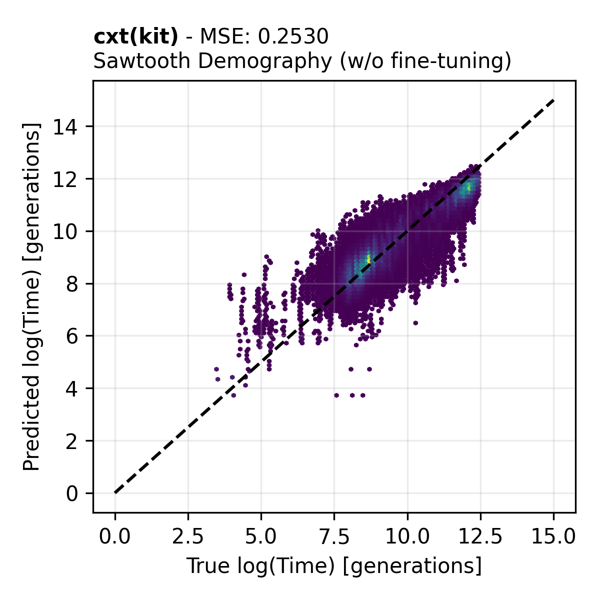

Gallery 
=======

cxt(kit)
--------

.. image:: ./inference_example_2.png
  :width: 800
  :alt: Prediction of a single example.

.. image:: ./heatmap_comparison.png
  :width: 800
  :alt: Alternative text

.. image:: ./inference_scatter_cxtkit_sawtooth_with_finetune.png
  :width: 400
  :alt: Sawooth demography inference with fine-tuning

.. image:: ./inference_scatter_cxtkit_island_no_finetune.png
  :width: 400
  :alt: Island demography inference without fine-tuning

.. image:: ./inference_scatter_cxtkit_island_with_finetune.png
  :width: 400
  :alt: Island demography inference with fine-tuning

Singer and Gamma-SMC
--------------------

.. image:: ./inference_scatter_gamma_smc_constant.png
  :width: 400
  :alt: Constant demography inference 

.. image:: ./inference_scatter_gamma_smc_sawtooth.png
  :width: 400
  :alt: Sawooth demography inference 

.. image:: ./inference_scatter_gamma_smc_island.png
  :width: 400
  :alt: Island demography inference 