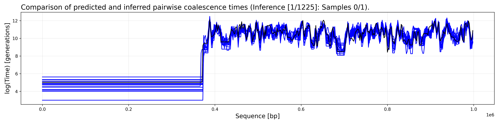

Quick start
===========

From simulation to inference in a few lines of code. 

.. code-block:: python

    from cxt.inference import translate_from_ts
    from cxt.config import TokenFreeDecoderConfig 
    from cxt.utils import simulate_parameterized_tree_sequence

    yhats, ytrues = translate_from_ts(
        ts = simulate_parameterized_tree_sequence(seed=102000),
        model_config=TokenFreeDecoderConfig(),
        model_path='../cxt/models/base_model/checkpoints/epoch=4-step=16160.ckpt',
    )

