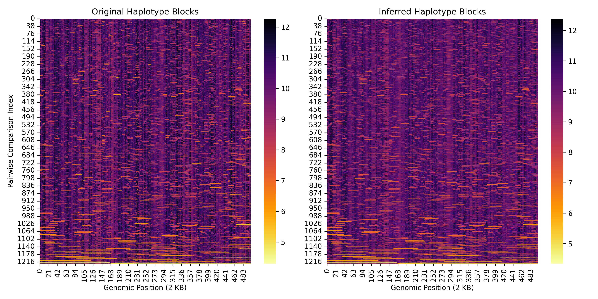

Tutorial for Inference
======================

A few examples of how to use the cxt package.

Constant Demography (Pairwise) Inference
--------------------------------------

The following code demonstrates the example usage for the base case of inferring
pairwise tmrca times of a sample size 50 (→ 1225 pairwise tmrca times) over a 1 MB
simulated fragment.

Loading a few functions for simulating the data and for inference and processing it.

.. code-block:: python

    import torch
    import numpy as np
    torch.set_float32_matmul_precision('medium')

    from cxt.config import TokenFreeDecoderConfig
    from cxt.utils import post_process, accumulating_mses, mse
    from cxt.inference import generate, load_model, prepare_ts_data
    from cxt.utils import simulate_parameterized_tree_sequence, TIMES

Model configuration and loading it. The was trained using Pytorch Lighting.

.. code-block:: python

    model = load_model(
        config=TokenFreeDecoderConfig(), 
        model_path='../cxt/models/base_model/checkpoints/epoch=4-step=16160.ckpt'
    )

Simulating the data.

.. code-block:: python

    SEED = 102000
    ts = simulate_parameterized_tree_sequence(SEED)
    src, tgt = prepare_ts_data(ts, num_samples=50, B=1225)

Running the actual inference, note that during each inference run the cache has
to be reset to zero. In order to avoid running unnessary replicates, a simple 
heuristic has been implemented to stop the inference when the derivative of the mse
is overall samples becomes less than less than 0.001.

.. code-block:: python

    max_replicates = 20
    yhats, ytrues = [], []
    for i in range(max_replicates):
        sequence = generate(model, src, B=1225)
        yhat, ytrue = post_process(tgt, sequence, TIMES)
        yhats.append(yhat)
        ytrues.append(ytrue)

        # early stopping criteria
        if i > 1:
            mses = accumulating_mses(yhats, ytrues)
            derivatives = np.diff(mses)
            if abs(derivatives[-1]) < 0.001:
                print(f"Stopping at {i} because derivative is {derivatives[-1]}.")
                break

** Plotting code not shown **

.. code-block:: python

      from cxt.inference import translate_from_ts
      from cxt.config import TokenFreeDecoderConfig 
      from cxt.utils import simulate_parameterized_tree_sequence

      ts = simulate_parameterized_tree_sequence(seed=103370001)
      yhats, ytrues = translate_from_ts(
          ts = ts,
          model_config=TokenFreeDecoderConfig(),
          model_path='../cxt/models/base_model/checkpoints/epoch=4-step=16160.ckpt',
      )

.. code-block:: python

      plt.figure(figsize=(16, 4))
      for i in range(13):
          sns.lineplot(y=yhats[i][0], x=range(0, 1_000_000, 2000), c="blue")
      sns.lineplot(y=ytrues[i][0], x=range(0, 1_000_000, 2000), c="black")
      plt.title("Comparison of predicted and inferred pairwise coalescence times (Inference [1/1225]: Samples 0/1).", fontsize=16, loc="left")
      plt.xlabel("Sequence [bp]", fontsize=14)
      plt.ylabel("log(Time) [generations]", fontsize=14)
      plt.grid(alpha=0.25)
      plt.tight_layout()
      plt.savefig("inference_example_2.png", dpi=300)

We continue by showing various scatter plots of the inferred pairwise coalescence times
for sawtooth and island demography models with and without fine-tuning.

Out-of-sample: Sawooth Demography Inference (no fine-tuning)
------------------------------------------------------------

The underlying demography is a sawtooth model with periodic population size changes. Our
language model is able to infer the pairwise coalescence times with a high degree of accuracy,
despite not being fine-tuned to the task at hand.

.. image:: ./inference_scatter_cxtkit_sawtooth_no_finetune.png
  :width: 400
  :alt: Sawooth demography inference without fine-tuning

Rescue: Sawooth Demography Inference (with fine-tuning)
-------------------------------------------------------

Interestingly, the fine-tuning of the language model on the sawtooth demography model leads to
much better performance like due to the decrease of entropy in the dataset as a consequence of
bottlenecks and expansions, shifting the distribution to a less complex space (making the task
easier to capture for the model).

Out-of-sample: Island Demography Inference (no fine-tuning)
-----------------------------------------------------------

The island demography model with three populations and migration between leads to accuratly
infered pairwise coalescence times.

.. image:: ./inference_scatter_cxtkit_island_no_finetune.png
  :width: 400
  :alt: Island demography inference without fine-tuning

Rescue: Island Demography Inference (with fine-tuning)
------------------------------------------------------

.. image:: ./inference_scatter_cxtkit_island_with_finetune.png
  :width: 400
  :alt: Island demography inference with fine-tuning

